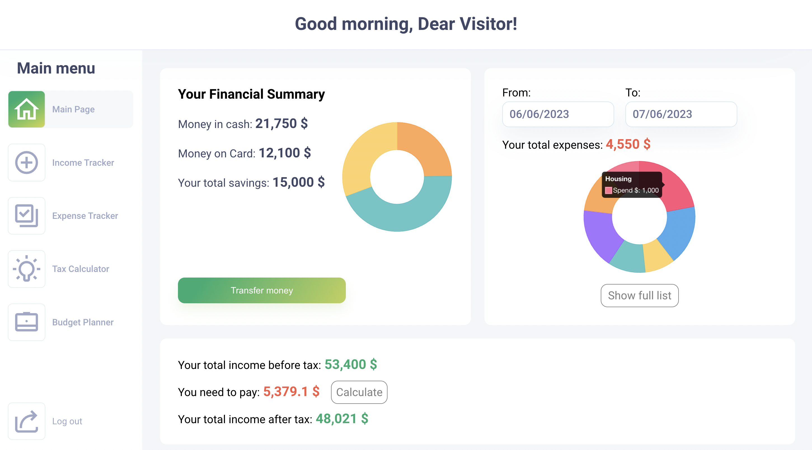

 

  <a href="https://budget-buddy-finance.netlify.app" target='_blank'>
    
<h3 align="center">Financial Management Application</h3>
  

A web application for managing your finance built using React, CSS, Redux, and Firebase.
     
    <a href="https://github.com/LychakVlad/financial-management-app"><strong>Explore the code »</strong></a>
     
     
    <a href="https://budget-buddy-finance.netlify.app">View Demo</a>
  

<!-- ABOUT THE PROJECT -->

## About The Project

This web-based financial management application was created to address a personal challenge I faced while working as a server. I struggled with accurately tracking my income and saving enough to cover my tax obligations. To solve this problem, I initially developed a tax calculator using Virginia tax rates. Building upon that, I added an income tracker to monitor my earnings, an expense tracker to keep track of my spending, and a budget planner to plan my finances effectively. I am continuously working on developing and improving this product to provide comprehensive financial management solutions.

### - Testing Coverage

- **End-to-End (E2E) Tests:** Major features like expense tracking, income tracking, tax calculation, and budget planning are thoroughly tested to ensure seamless user experiences.

- **Unit Tests:** Approximately 50% of the codebase is covered by unit tests, validating individual components and functions for accuracy.

### - Expense Tracker

With the expense tracking feature, users can easily monitor and categorize their expenses. They can input their expenditures, assign them to relevant categories (e.g., housing, transportation, groceries), and track their spending over time. The application provides visual representation such as chart to help users understand their spending patterns and make adjustments to their budgets if needed.

### - Income Tracker

The Income Tracker feature allows users to conveniently track their various sources of income. Users can input the amount, date, and indicate whether the income is taxable or not.

### - Tax Calculation

The financial management application simplifies tax calculation. Users can input their income, deductions, and filing status in a user-friendly interface. Utilizing up-to-date tax regulations and algorithms, the application quickly estimates tax liability. Users can make informed financial decisions based on the calculated tax obligations.

### - Budget Planner

The budget planner feature allows users to enter their desired amounts for needs, wants, and savings categories. It enables users to compare their allocations with the 50/30/20 system based on their income after taxes. This helps users effectively manage their finances and maintain a balanced budget.

### - Authentication

To ensure data privacy and security, the financial management application incorporates user authentication. Users can create personal accounts, log in securely, and access their financial information. The authentication system safeguards sensitive financial data and prevents unauthorized access.

### Built With

- React js
- Css
- Redux
- Firebase

## Contact

Vladislav Lychak - [@LinkedIn](https://www.linkedin.com/in/vladislav-lychak/) - lycakvladislav@gmail.com

Project Link: [https://budget-buddy-finance.netlify.app](https://budget-buddy-finance.netlify.app)

(<a href="#readme-top">back to top</a>)

<!-- MARKDOWN LINKS & IMAGES -->
<!-- https://www.markdownguide.org/basic-syntax/#reference-style-links -->

[react.js]: https://img.shields.io/badge/React-20232A?style=for-the-badge&logo=react&logoColor=61DAFB
[react-url]: https://reactjs.org/
